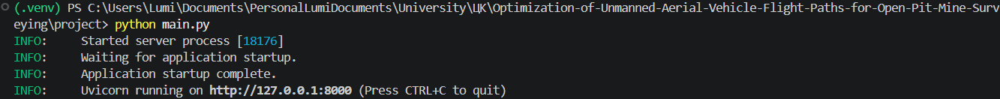
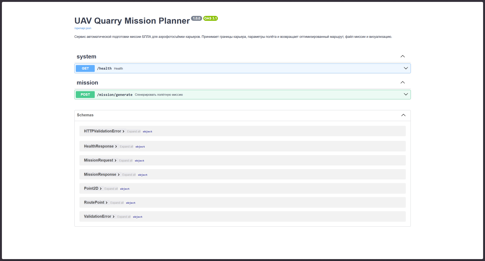
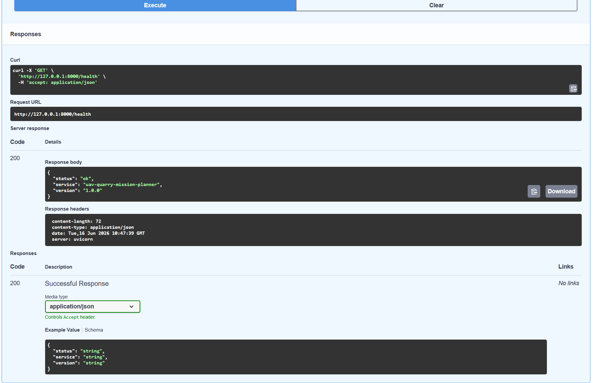
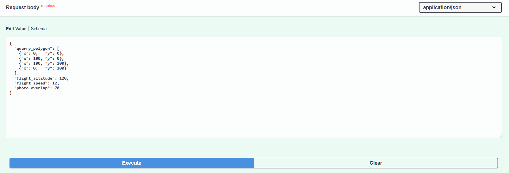
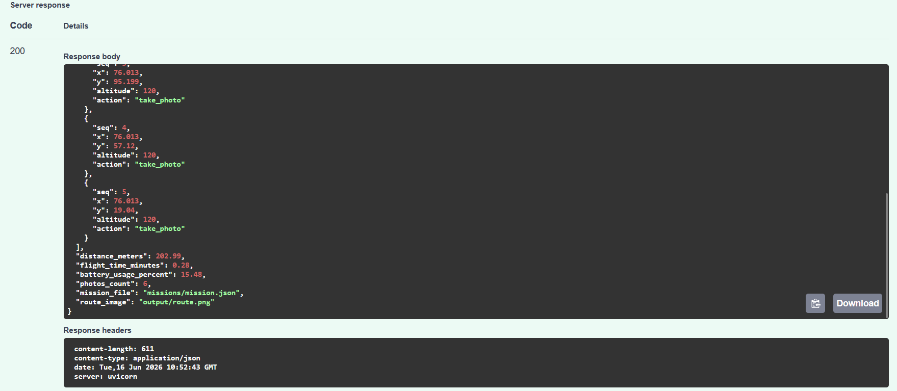
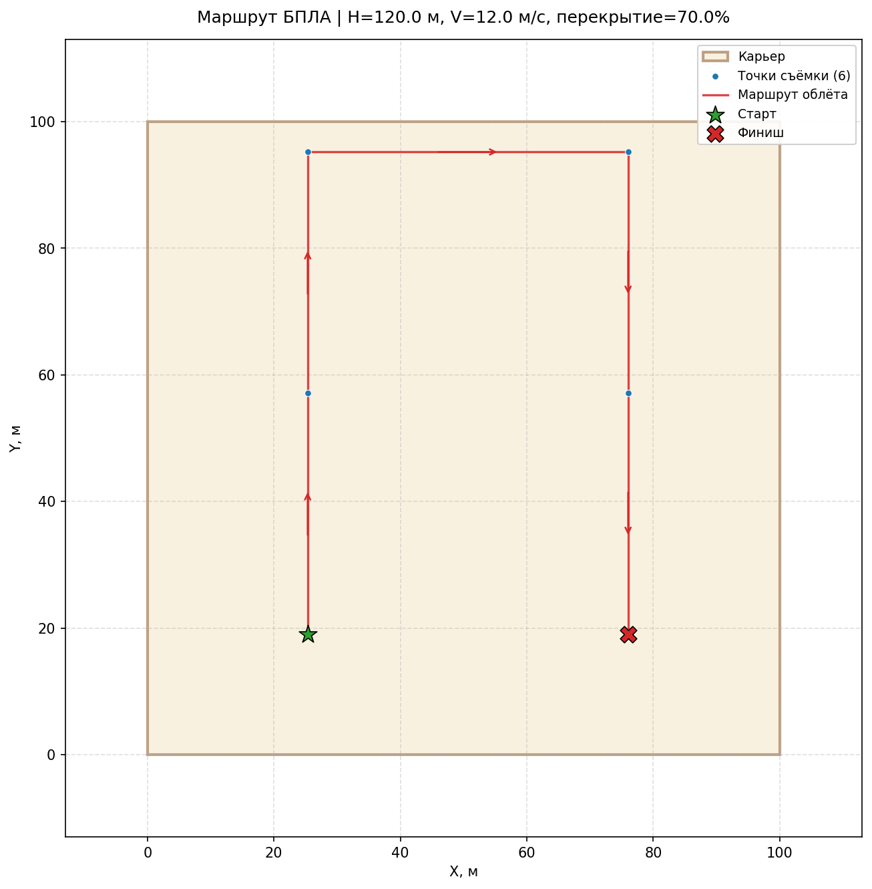
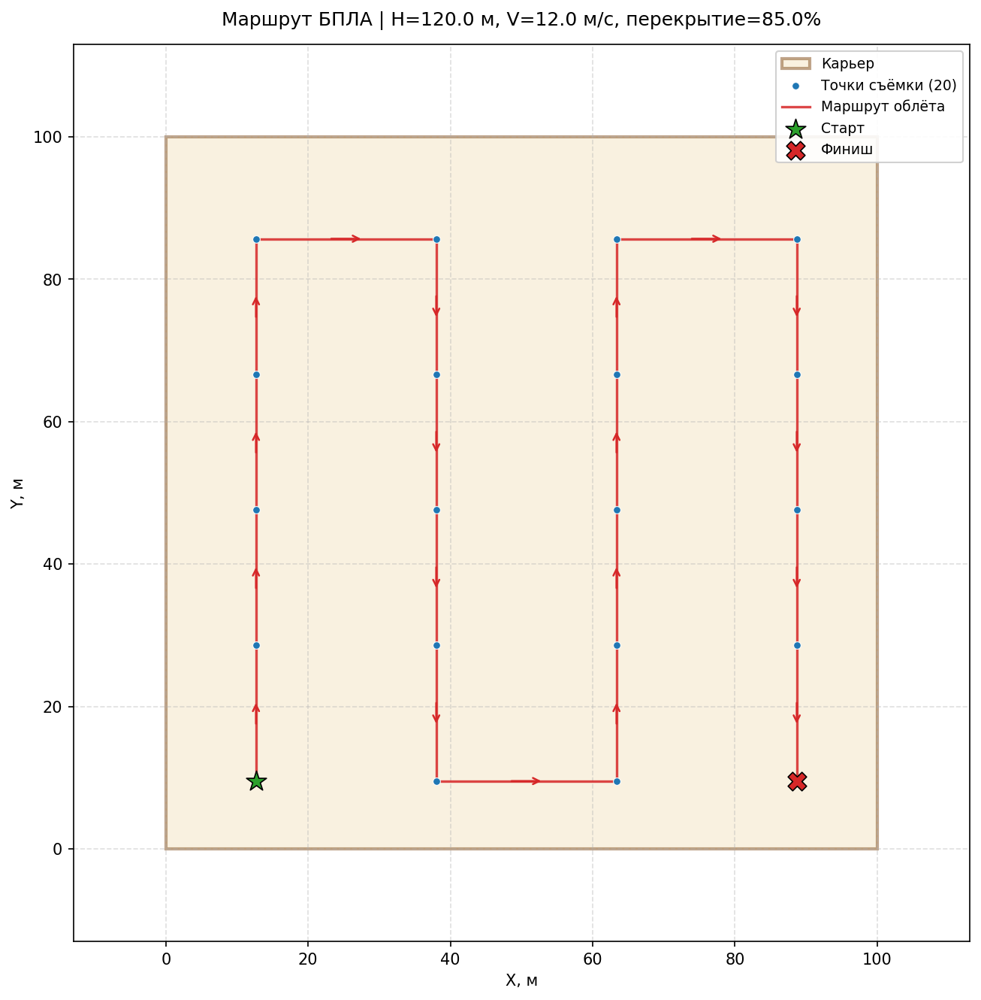
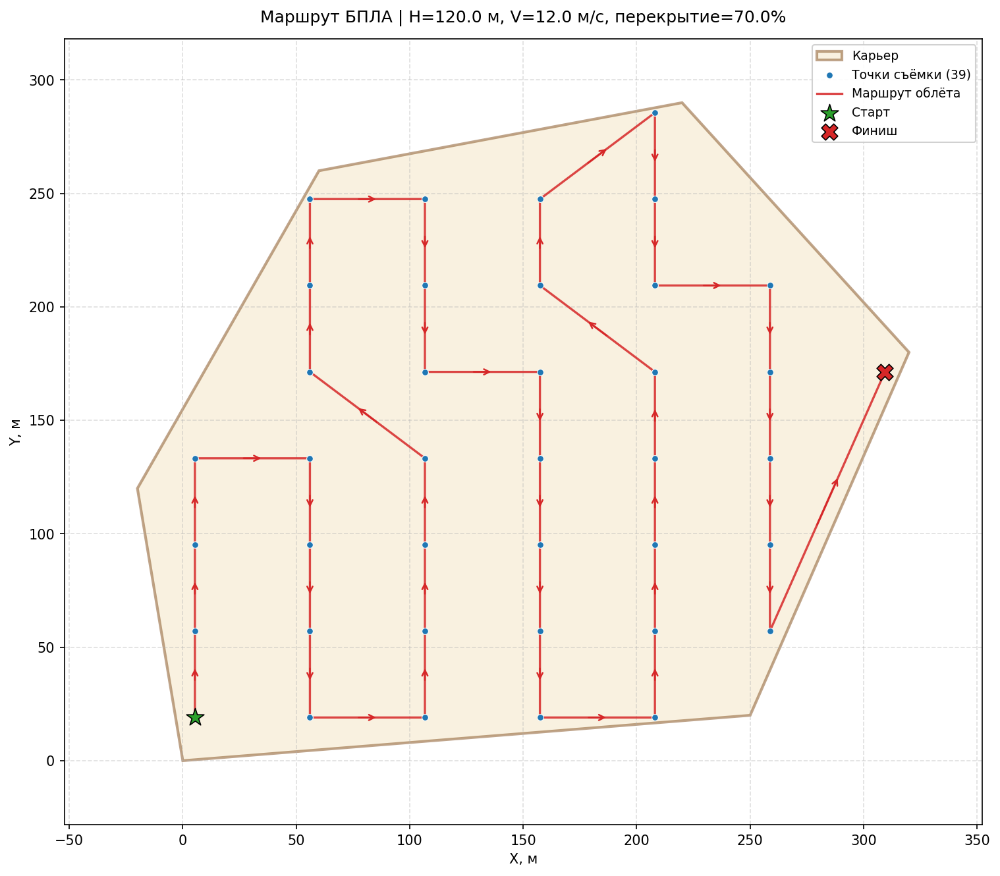
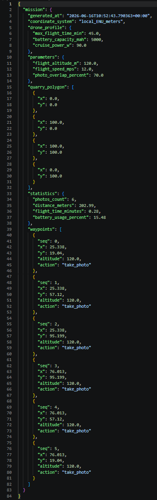
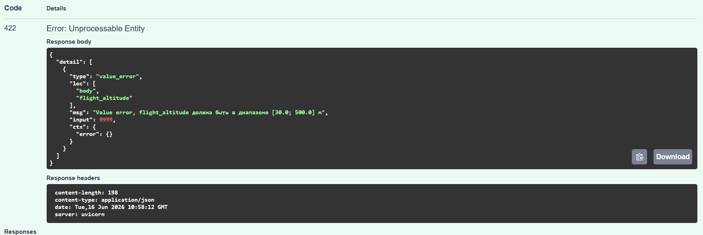

# Project_UAV

## Цель проекта:
Оптимизация маршрутов беспилотных летательных аппаратов для аэрофотосъёмки карьеров.

Программное решение принимает на вход границы карьера в виде полигона, высоту полёта, скорость и желаемое перекрытие снимков, и автоматически готовит полётную миссию БПЛА: рассчитывает регулярную сетку точек съёмки, строит и оптимизирует маршрут облёта, оценивает длину маршрута, время полёта, расход батареи и количество необходимых снимков.

При применении данного решения на практике используется REST API сервис, реализованный в файле `main.py`. На вход поступает JSON с описанием карьера и параметрами полёта, на выходе формируется готовый файл миссии `mission.json` для загрузки в наземную станцию управления и визуализация маршрута `route.png`.

В `services/mission_generator.py` — основной конвейер генерации миссии.
В `services/route_optimizer.py` — алгоритмы построения маршрута (Nearest Neighbor + 2-opt).
В `services/battery_estimator.py` — энергетическая модель расхода батареи.

## Стек технологий:
Python 3.11+, FastAPI, Pydantic, Shapely, NumPy, Matplotlib, Uvicorn

## Примеры входных данных
Хранятся в папке `examples/`:
- `request_example.json` — пример входного запроса
- `mission_example.json` — пример сгенерированного файла миссии

## Скриншоты

**Запущенный сервер:**

---

**Swagger UI — главная страница с эндпоинтами:**

---

**Проверка работоспособности GET /health — ответ 200 OK:**

---

**Генерация миссии — запрос для прямоугольного карьера 100×100 м, высота 120 м, перекрытие 70%:**

**Ответ API — маршрут построен, батарея рассчитана:**

---

**Визуализация маршрута — прямоугольный карьер, перекрытие 70%:**

Синие точки — узлы сетки съёмки. Красная линия — оптимизированный маршрут со стрелками направления. Зелёная звезда — старт, красный крест — финиш.

---

**Влияние перекрытия снимков на плотность маршрута:**

Перекрытие 70% — меньше точек, короче маршрут:

Перекрытие 85% — точек больше, маршрут длиннее, расход батареи выше:

---

**Визуализация маршрута для карьера сложной формы (6 вершин, невыпуклый контур):**

---

**Файл миссии mission.json открытый в редакторе:**

---

**Проверка валидации — при неверной высоте полёта (9999 м) сервис возвращает 422:**

## Ссылки
Исходный код проекта: https://github.com/Lumi4s/uav-quarry-mission-planner.git

Демонстрация работы: ЗАГЛУШКА

Презентация: ЗАГЛУШКА
